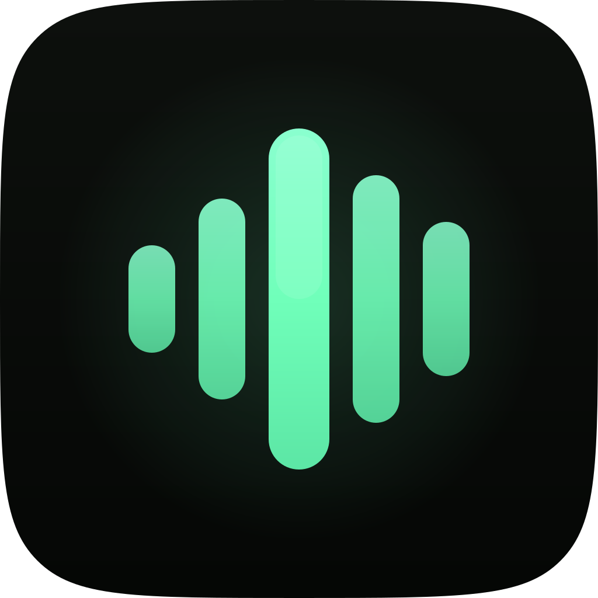
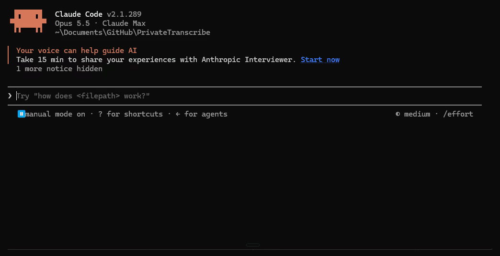

<div align="center">



# PrivateTranscribe

**Fast local dictation for AI workflows.**<br>
Free and open source, for Windows.

[](https://privatetranscribe.com/?utm_source=github&utm_medium=readme)

[](CHANGELOG.md)
[](LICENSE)
[](https://github.com/PrivateTranscribe/PrivateTranscribe/actions/workflows/ci.yml)



</div>

## How it works

1. **Tap** your hotkey in whatever app is in front of you. Prefer push-to-talk? Hold it instead.
2. **Talk.** Say the messy version out loud. Whisper writes it down on your own PC.
3. **Done.** Tap again and the text pastes at your cursor. No window to switch to, nothing to copy.

## Why it exists

- **Your voice stays on your PC by default.** Local Whisper does the transcription. Cloud transcription is there if you want it, with your own API key.
- **Dictation should not be monthly rent.** The whole app is free, with no account and no subscription.
- **You think faster than you type.** Talk through the long prompt for Claude Code, Cursor or ChatGPT, and let the agent clean it up.

## What it is good at

- **Prompting coding agents.** Explain the bug out loud in a terminal or an editor, the way you would to a colleague, and the full prompt lands where your cursor is.
- **Writing anywhere.** Mail, chat, documents, forms. It pastes into the app in front of you, and puts your clipboard back afterwards.
- **Names and jargon.** Add them to the dictionary once, and Whisper gets them right after that.
- **Calls and music.** While you dictate, other audio drops to half volume. Turn on voice-call mute and the app holds your Discord mute key, so the call does not hear you.
- **Reading back.** Select text in any app and press a key to hear it read aloud by a voice that runs on your PC.
- **Old recordings.** Drop in an audio or video file to get a transcript.

## Features

- Local Whisper models from tiny to large, with turbo as the fast default
- An optional NVIDIA GPU engine for much faster transcription
- Optional cloud transcription through OpenAI, Groq or your own endpoint
- Tap, push-to-talk, or tap-and-hold, on any key combination or a mouse side button
- Custom dictionary, history and a dashboard of your dictation stats
- Read Aloud with 28 local English voices (beta)

<details>
<summary><b>Beta and experimental features</b> (off until you turn them on in Settings)</summary>

<br>

**Beta**

- **AI enhancement** cleans up a dictation with a model you choose. OpenAI, Anthropic, Gemini, Groq, a local model, your own endpoint, or the Claude Code CLI.
- **Correction Memory** learns from the edits you make after a paste.
- **Smart Context** tells AI enhancement which app, window and field you are dictating into.

**Experimental**

- **Converse** is a spoken conversation with Claude Code in a project folder.
- **Agent mode** turns a dictation into a coding prompt.
- **Action Engine** runs actions you set up when a dictation matches a trigger phrase.

</details>

## What leaves your PC

With a local model, your audio and text stay on your PC. They leave only when you pick a cloud service for transcription or AI enhancement, and then only to that service. Official builds check for updates, and send usage events under a random ID only if you agree. Models download when you ask for them. [SECURITY.md](.github/SECURITY.md) lists everything the app can do on your PC and everything that can leave it.

## Requirements

- Windows 10 or later
- An NVIDIA graphics card is optional, for the GPU engine

## Development

You need Node.js 22. [CONTRIBUTING.md](.github/CONTRIBUTING.md) has the full setup and the checks to run before a pull request.

```bash
npm ci
npm run dev
```

Most of the code is written with AI coding agents, mainly Claude Code, directed and tested by one developer.

## Building

```bash
npm run build:win    # Windows installer + portable
npm run pack         # Unsigned build for local testing
```

Official releases are built and signed by GitHub Actions. Copies you build yourself do not check for app updates or send usage events.

## Contributing

Bug fixes and bug reports are welcome. Start with [CONTRIBUTING.md](.github/CONTRIBUTING.md), and see [SUPPORT.md](.github/SUPPORT.md) for where to ask questions.

## License

Copyright © 2026 Julsgaard Products.

PrivateTranscribe is free software under the GNU General Public License, version 3 or (at your option) any later version. See [LICENSE](LICENSE).

PrivateTranscribe began as a private copy of [OpenWhispr](https://github.com/OpenWhispr/openwhispr) (MIT) in early 2026 and has been rewritten since. The whole history of this repository is released under GPL-3.0-or-later, including the commits from before the code was opened, whose LICENSE file said otherwise. OpenWhispr's MIT notice in [THIRD_PARTY_NOTICES.md](THIRD_PARTY_NOTICES.md) covers every commit, and the third-party parts listed there keep their own licences.
